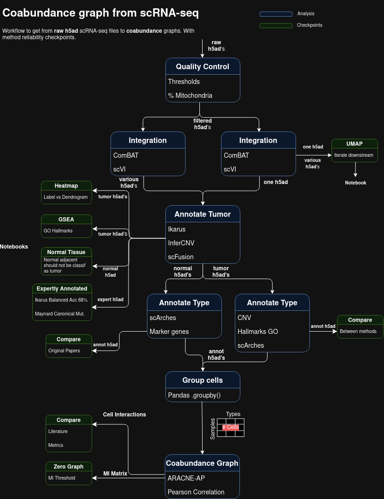

# Coabundance networks of NSCLC lung tumor cells from scRNAseq data

The main objective of this project is to perform an ecological analysis of the cell types in NSCLC lung tumor tissues from scRNA-seq data, in both early and late tumor stages.

The chosen methodology is to annotate cell types with the help of a newly trained reference atlas. For this, we use the [scvi](https://github.com/scverse/scvi-tools) framework. We base our work on the study by [Salcher, Sturm, Horvath et al. 2022](https://pubmed.ncbi.nlm.nih.gov/36368318/), where they gathered and standardized most of the data. 

Additionally, we expanded the atlas with four more datasets, optimized the hyperparameters of our deep learning model, and trained it to also predict tumor cell types. The prediction was better than with the most used method [InferCNV](https://github.com/broadinstitute/infercnv)

Subsequently, we obtained coabundance metrics. We chose the mutual inference (MI) metric, as it captures non-linear correlations in the data, and the methodology in the [ARACNE-AP](https://github.com/califano-lab/ARACNe-AP) package ensures a smaller possibility of spurious correlations.

After that, we obtained various visualizations of the networks and extracted mesoscopic and global properties of the graphs.

The workflow for getting from the raw AnnData files to the coabundance graphs and their analysis can be seen in the figure below:




## Running

We have designed a Docker image that has all the necessary libraries. It is, however, very large because it includes all the R and Python packages, including those for ML. It is around 15GB without InferCNV and Ikarus.

To run the notebook, you should run the container with this notebook repository mounted as a volume. In the following command, `$HOME/2021-SC-HCA-LATAM/CONTAINER` is the path of the repository, and the other path is where the large data files would be stored.

You must install the apt package `docker-nvidia` for the GPU flags to work and, of course, have a working CUDA installation.

```bash
docker run --interactive --runtime=nvidia --gpus all --tty --name comp_onco --publish 8888-8892:8888-8892 --volume $HOME/2021-SC-HCA-LATAM/CONTAINER:/root/host_home --volume /datos:/root/datos --workdir /root/host_home/ netopaas/comp-onco:r4 /bin/bash
```

### Jupyter lab

We publish some ports to use the Jupyter server.

After that, just run the command `jl` inside the container, and a Jupyter Lab server will be launched.

To acces it from a local computer you can do some port forwarding with something akin to this command:

```bash
ssh -p 5265 -N -f -L 5432:localhost:8888 sefirot.inmegen.gob.mx
```

Where 5432 is the localport where you will be running the server. 8888 is the port in the remote machine where juptyer server is being forwarded to by the container.
And -p 5265 is the por tof the remote host. You have to have and ssh-agent with your user credentials for this to work. We recommend it as it frees you of the hassle
of inputting a password everyitme.

### VS Code

You can also skip the port forwarding and work in a more integrated environment, by using the remote explorer and dev contianers feature of VScode.

Just add a new host for the remote host via shh and enter it. VScode will automatically install all the necessary packages to be able to interact with the host.
After that go to the Dev Containers tab in the Remote Explorer tab and choose the container that you ran as per the instructions above.

When opening a notebook, we recommend attaching to a running jupyter server, which is launched with the `jl` command in a shell in the container, like above.
This avoids losing the running kernel if you close the window you are working on.

A problem with vscode is that it does not offer a way to shutdown notebooks you'll have to do it manuall with 
a notebook to delete not recently used kernels in `./utils/cull-kernles.ipynb`. It uses api calls.

## Folder structure

The workflow is spread across various notebooks, where one can see the figures generated in the proccess and some short explanations. 
We plan to automatize the process with Nextflow, like they do in the repo of the [scLUCA](https://github.com/icbi-lab/luca) project.

But for now all the necessary steps are contained in the notebooks and scripts, though a little scrambled. The notebooks are explained in the order in which they should be run.

### Notebooks

- *get_data.ipynb*: Contains the code for exploring and downloading all possible datasets to extend the scLUCA atlas. It was important to have UMI counts and tumor stage annotation.

- *nb_filter*: Filters the cells and genes by predefined quality control metrics.

- *nb_refAtlas*: Contains the notebook `vae_raytune` for running and inspecting various experiments of hyperparameter exploration. The notebook `scANVImodel` has the reasoning and training of the actual reference atlas.

- *nb_annotRefatlas*: Annotates tissue from a new study by doing surgery and has integrated quality plots. Also annotates broad tumor cell types. Includes a notebook for annotation with label transfer via neighbors, but it had worse outcomes (`labelTransfer`). There is also a notebook that transfers the newly created clusters to another dataset (`extendPreds_{dataset}.ipynb`).

- *nb_subCluster*: It includes `Tumor_subcluster.ipynb` that redefines the atlas with new unsupervised tumor cells. Some attempts to accelerate this with `faiss` (GPU accel) are in the python scripts starting with faiss.

- *grouping_MI.ipynb*: It contains the crucial parts of gathering all annotations, grouping them by samples and cell type, running the coabundance analysis by extracting MI.

- *nb_graphAnalysis*: Parametrized file for doing a MI (Mutual Inference) graph analysis of an already provided list of edges between cell types.
  - *graph_layouts.ipynb* Leiden, Newman, n-clique, interactive, and functionally enriched visualizations of the networks for different clusterings and times.
  - *pearson_compare.ipynb* Adds pearson correlation information to the existing MI graph, and analyzes paris of vars that are not pearson correlated and their profile. Also for the negative ones.
  - *sbm_cluster.ipynb* Does stochastick block modelling (thans to the impressive package `graph-tools`) of the network and outputs the most beautifual circos plot layouts of the graphs. Also very informative.
    The dependecies of `graph-tools` are a hassle, so we recommend running it in their container. Instructions are in the nb.
  - *graph_param.ipynb* Extract more mesoscopic features of the graph, like redundancy and degree plots...
  - *circos.ipynb*  Circos plots with igraph, not neccesary with the help of `graph-tools`.

- *nb_DE_wilcox*: 
  - *<dset>_<region>.ipynb* Extracts marker genes of clusters from existing cell annotations with the Wilcox method. 
  It also enriches for Hallmark gene ontologies. Its a bit bit convoluted and doesnt consider batch effects,
  but only because it scanpy doenst consider abundance of cell types.
  - *modal_DE.py* script to run the Wilcox marker gene extraction in modal.
    It generalizes well for all datasets, but one has to upload the files to the volume manually for now.
    Additionally it has some flas to run it locally. We prefer this to the notebooks.. that are only left there for the figures and explanations of older runs.
  - *DE_incomplete.ipynb* is incomplete and attempts to do pseudo-bulk differential expression with MAST.

### Optional (or deprecated) Notebooks

- *nb_DE_SCT*: Extracts marker genes of clusters from existing cell annotations with the GLM method `SCTransform v2`.
  It also corrects for batch effects per sample and enriches for Hallmark gene ontologies. 
  This method has a parameter estimation method that corrects for lowly expressed genes and is much faster
  than the `lvm_DE` method, which takes advantage of our dimensional reduction VAEs with scANVI.
  The `test_de.py` script is to be run in the lambda function service Modal,
  as it requires a lot of GPU RAM and takes around 35 minutes for 3 samples. It uses the `lvm_DE` method mentioned above.

- *nb_ikarus*: Runs the ikarus prediction on every dataset from `ikaurs_fabric.py`. A prediction that uses logistic regression and network projection to predict tumor cells.

- *nb_infercnv*: Runs InferCNV on every dataset from `infercnv_fabric.py`. This infers from transcripts, places in the chromosomes where there should be copy number variations, hence cancer cells.

- *nb_tumorUMAP*: Notebook to check the tumor predictions. It has the DE part integrated. `Tumor_Annot.ipynb` contains explanations of the methods used.

- *nb_annot*: Annotates tissue from every study with Lung Atlas reference maps. Only healthy cells.

### Misc

- *outputARACNE*: Contains all the files for the generation and output of the networks by ARACNE, including functional enrichment.
- *metadata*: Contains information about the studies used `dsets.csv` and data about the number of cells per sample `groups_**`.
- *utils*: Contains custom plotting and analysis functions.

### Data Dirs

#### Neccesary input

The only data neccesary to run the workflow from scratch are:
- `/root/datos/maestria/netopaas/luca/data/atlas/extended.h5ad` Which can be gotten from https://cellxgene.cziscience.com/collections/edb893ee-4066-4128-9aec-5eb2b03f8287
- `/root/datos/maestria/netopaas/<ds_suffix><year>/` The datasets downloaded in the noteboook `get_data.ipynb`. We tried lots but stayed with only Bishoff, Hu, Zuani and Deng.
- Also the metadata in `metadata/dsets.csv` describes all the datasets and one can check the inclusion criteria for the analysis in there.

#### All dirs

- */root/datos/maestria/netopaas/luca/data/atlas/*  Has the LUCA atlas files from Salcher et. al.  It has pretty extensive metadata.
  We have saved some subsets, the most import being 'extended_tumor_hvg.h5ad' that uses the extended atlas, but only has tumor samples and highly var genes.

- */root/datos/maestria/netopaas/<ds_suffix><year>/*  Folder where all the files necessary to download the dataset to an acceptable h5ad are.

- */root/datos/maestria/netopaas/lung_scRNA/LUCA_model/*  Contains the models trained by us, but also the ones from LUCA.
  In particular '/hvg_integrated_scvi_scanvi_tumor_model_b128_lay4_h1024_raydefault_epocs300-300/' is the one with the highest accuracy, 
  trained in 'nb_ref_Atlas/scANVImodel.ipynb'

- *surgeries = '/root/datos/maestria/netopaas/luca_explore/surgeries/'* Has most of the checkpoints in our workflow.

  - *'filtered_<ds_suffix>.h5ad'* Is the adata of the dataset after QC filtering.

  - *'query_<ds_suffix>.h5ad'* Is the adata of the dataset in the necessary fromat to be annotated by the model.

  - *'<dataset_suffix>/'* Folder that contains the trained surgery model in 'model.pt'. Most of them also have an adata of the latent vars in `query_latent.h5ad`.
    Sometimes a csv to convert from gen symbols to ensembl in `<ds_suffix>_ensembl.csv`

  - *'<ds_suffix>_predicted.csv'* The cell annotations with just our Tumor LUCA model. It also has all the entries of the obs matrix, so stage and such.

  - *'Subcluster/'*
    - *query_latent_<tumor>_<time>.h5ad* The merged embedding of all the annotated datasets for subclustering. SUbset to tumor and respective time stages.
    - *atlas_<time>_umap.csv* The umap coords calculated online in modal.
    - *atlas_<time>_uparams.json* The umap coords params calculated online in modal. Also params for the leiden algo.
    - *atlas_<time>_leiden.csv* The subclustering assignment of cells.
    - *mapping_<time>_leiden.json* The broad cluster annotation by chekcing contingency with previous cluster names.
  
  - *'<ds_suffix>_predicted_leiden.csv'* The cell anotations with tumor subclustering.


## Docker images

We have kept some varied docker images because of compatiblity issues. They are orderd from newest to oldest.

- *netopaas/comp-onco:annot* 14.6G The image below but with BioMaRt and pandas==1.5.3
- *netopaas/comp-onco:sctransform* 16G Added support for sctransform, our only candidate for batch effect correction a the expression level. Does not have biomaRt. Does not have pandas==1.5.3
- *netopaas/comp_onco:r4* 14.1G   Newer R version to be able to convert from and to SeuratObject and Anndata. Does not have biomart. Does not have pandas==1.5.3
- *netopaas/comp-onco:raytune*  13.6G  Some fixes to be able to run the hyperparameter optimization tool raytune. This one does not have cuda aware jax.
- *netopaas/scarches:raytune* 19.9 G The same but with more R packages than comp-onco. This one has jax.
- *netopaas/scarches:droplet*   85G This one has infercnv, ikarus and scFusion that take a lot of space. It wont be able to run raytune and sctransform and others.

- *tiagopeixoto/graph-tool:latest*  3.18G  For creating our beautiful circos graphs. The dependencies are hell so we have them in a separate container.
- *netopaas/faiss:cugraph-24-12*  For doing faiss nearest neghbours, leiden and umap much faster and using Modal. It has been a nightmare to keep the dependecies correct in this one.


## Troubleshooting

### Jupyter Kernels
Due to the long training and annealing times, Jupyter Lab sometimes cannot connect. Use this to get a console to the kernel:
```bash
jupyter console --existing /root/.local/share/jupyter/runtime/kernel-9ff04919-e8c2-4ecf-92ce-c66b988720e5.json
```
For this you need to have `pip install jupyter-console` installed.

This could be easier in a newer version of Jupyter Lab. To locate the corresponding JSON file, you can use `htop` with the option to not display user branches and see the memory it is using.

### CUDA

It is important to install the Docker NVIDIA package to transfer your CUDA installation to the containers.

### Git

If you keep your repository inside the container via volumes, the user might change. We recommend configuring the SSH keys inside the container. These are the steps:

```bash
git config --global user.email ernesto.paas@ciencias.unam.mx
git config --global user.name "Ernesto Paas"
```

We suggest saving a key pair that can be generated with the command `ssh-keygen -t ed25519 -C "your_email@example.com"` in the Docker volume (folder) that contains the repository, and then copying them to `~/.ssh/id_ed25519` etc., to have SSH authentication with GitHub. Remember to have the SSH agent activated `eval "$(ssh-agent -s)"` and the key added `ssh-add ~/.ssh/id_ed25519`. Ensure that the key is read-only.
