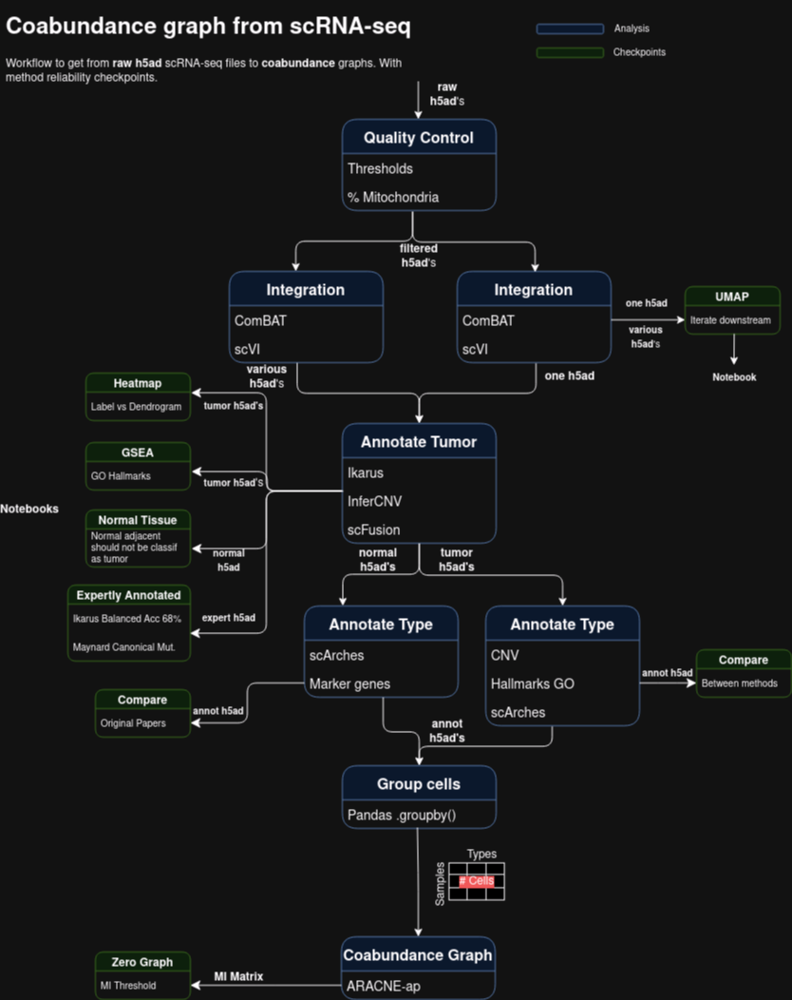

# Exploring of the scLUCA dataset

For building coabundance networks.

We are basing ourselves on the wonderful work by [Salcher, Sturm, Horvath et al. 2022](https://pubmed.ncbi.nlm.nih.gov/36368318/)

The workflow for getting from the raw AnnData files to the the coabundance graphs is this one:



## Troubleshooting

Due to the long training and annealing times, jlab sometimes cannot connect.
Use this to get a console to the kernel:
`ipython console --existing /root/.local/share/jupyter/runtime/kernel-50c440a3-554d-4d98-bb90-bdda9a8923d5.json`

This could be easier in a newer version of jlab. To locate the corresponding json
you can use htop with option to not display user branches and seeing the memory it
is using.

In this image: python:3.11.4. It is important
to install the docker nvidia package to 
transfer your cuda installation to the
caontainers.
We have installed this:

```
# For editing in shell
apt install nano

# Pre-req for scArches
apt install nodejs
 
# For cell annotation
pip install scarches==0.5.9

# For notebooks
pip install jupyterlab==3.2.4
alias jl='jupyter-lab --no-browser --ip=0.0.0.0 --allow-root /root/host_home'

# For visualizing and builidng networks
apt install libgraphviz-dev
apt install graphviz
pip install networkx
pip install pygraphviz

# For R
apt install gfortran
wget https://cran.rstudio.com/src/base/R-4/R-4.3.1.tar.gz
tar xvfz R-4.3.1.tar.gz && rm R-4.3.1.tar.gz
cd R-4.3.1
./configure --enable-R-shlib --with-cairo --with-libpng --prefix=/opt/R/
make && make install
cd /opt/R
rm -rf /opt/R/R-4.3.1
echo 'PATH="/opt/R/bin:${PATH}"' >> ~/.bashrc
echo 'LD_LIBRARY_PATH="/opt/R/lib/R/lib:${LD_LIBRARY_PATH}"' >> ~/.bashrc

# R libraries
apt install libharfbuzz-dev libfribidi-dev
Rscript -e "update.packages(ask=FALSE, repos='https://cran.itam.mx/')"
Rscript -e "install.packages(c('devtools', 'gam', 'RColorBrewer', 'BiocManager', 'IRkernel'), repos='https://cran.itam.mx/')"
Rscript -e "IRkernel::installspec(user = FALSE)"
Rscript -e "devtools::install_github('MatteoBlla/PsiNorm')"
```