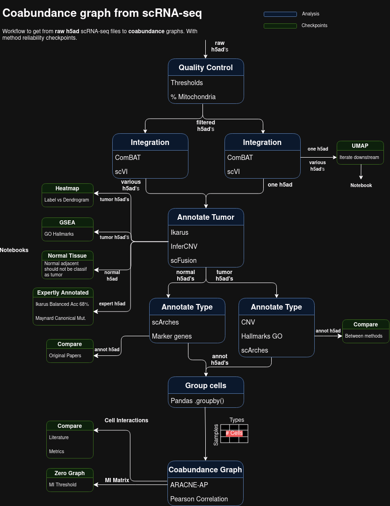

# Coabundance Networks Of NSCLC Lung Tumor Cells

This project performs an ecological analysis of cell types in non-small-cell
lung cancer (NSCLC) tumor tissue from single-cell RNA sequencing data, comparing
early and late tumor stages.

Cell types are annotated using a newly trained reference atlas built with the
[scvi-tools](https://github.com/scverse/scvi-tools) framework. The work builds
on the standardized lung cancer atlas assembled by
[Salcher, Sturm, Horvath et al. (2022)](https://pubmed.ncbi.nlm.nih.gov/36368318/).
We expanded that atlas with four additional datasets, optimized the deep
learning model, and trained it to predict tumor cell types.

The annotated cells are aggregated into patient-level cell-type abundances.
Coabundance networks are inferred using mutual information because it can
capture nonlinear associations. The
[ARACNe-AP](https://github.com/califano-lab/ARACNe-AP) workflow reduces
spurious associations through bootstrapping and data-processing-inequality
pruning. The resulting networks are used to identify patient ecotypes, inspect
graph structure, extract cluster-specific marker genes, and rank
dataset-consensus ligand-receptor interactions with CellPhoneDB.

The original high-level workflow from raw AnnData files to coabundance graph
analysis is shown below:



This repository contains exploratory notebooks and reproducible scripts for the
pipeline. Run commands from the repository root. Repository paths are defined
in `shared/paths.py`; full marker and CellPhoneDB production runs remain on
external storage.

## Canonical Workflow

1. **Data acquisition: `nb_dataAcquisition`**
   - Entrypoints: `get_data.ipynb`, `run_EmptyDrop.R`, `run_EmptyDrop_batch.R`
   - Prerequisites: dataset manifests and source download credentials
   - Produces: downloaded/raw data and EmptyDrops matrices on external storage
   - Command: `jupyter lab nb_dataAcquisition/get_data.ipynb`

2. **Quality filtering: `nb_filters`**
   - Entrypoint: `filter_param.ipynb` and dataset notebooks
   - Prerequisite: acquired count matrices
   - Produces: filtered AnnData files on external storage
   - Command: `jupyter lab nb_filters/filter_param.ipynb`

3. **Reference atlas training: `nb_refAtlas`**
   - Entrypoint: `scANVImodel.ipynb`
   - Prerequisite: filtered reference datasets
   - Produces: trained atlas model on external storage
   - Command: `jupyter lab nb_refAtlas/scANVImodel.ipynb`

4. **Dataset annotation: `nb_annotRefatlas`**
   - Entrypoint: `labelTransfer.ipynb` and dataset notebooks
   - Prerequisites: filtered datasets and reference atlas
   - Produces: transferred cell-type annotations on external storage
   - Command: `jupyter lab nb_annotRefatlas/labelTransfer.ipynb`

5. **Tumor subclustering: `nb_subCluster`**
   - Entrypoint: `Tumor_subcluster.ipynb`
   - Prerequisite: annotated tumor cells
   - Produces: tumor subcluster predictions on external storage
   - Command: `jupyter lab nb_subCluster/Tumor_subcluster.ipynb`

6. **Global coabundance and ARACNe generation: `nb_graphGeneration`**
   - Entrypoint: `grouping_MI.ipynb`
   - Prerequisite: cell annotations and sample metadata
   - Produces: `results/graph_generation/global/`
   - Command: `jupyter lab nb_graphGeneration/grouping_MI.ipynb`

7. **Patient/ecotype clustering: `nb_ecotypeClustering`**
   - Entrypoint: `abund_clusters.ipynb`
   - Prerequisite: global coabundance matrices
   - Produces: `results/ecotype_clustering/`
   - Command: `jupyter lab nb_ecotypeClustering/abund_clusters.ipynb`

8. **Per-cluster ARACNe and Pearson post-processing: `nb_graphGeneration`**
   - Entrypoints: `run_aracne_by_cluster.py`, `postprocess_cluster_networks.py`
   - Prerequisites: global matrices and ecotype membership CSVs
   - Produces: `results/graph_generation/cluster_runs/`
   - Commands:
     ```bash
     python nb_graphGeneration/run_aracne_by_cluster.py --dry-run
     python nb_graphGeneration/run_aracne_by_cluster.py
     python nb_graphGeneration/postprocess_cluster_networks.py
     ```

9. **Graph layouts and downstream analysis: `nb_graphAnalysis`**
   - Entrypoints: `graph_layouts.ipynb`, `sbm_cluster.ipynb`, `circos.ipynb`
   - Prerequisite: global and per-cluster graph outputs
   - Produces: `results/graph_analysis/`
   - Command: `jupyter lab nb_graphAnalysis/graph_layouts.ipynb`

10. **Cluster-specific marker extraction: `nb_DE_wilcox`**
    - Entrypoint: `run_marker_extraction.py`
    - Prerequisites: annotated AnnData files and ecotype membership CSVs
    - Produces: full external marker runs; compact summaries in
      `results/marker_genes/`
    - Commands:
      ```bash
      python nb_DE_wilcox/run_marker_extraction.py --dry-run
      python nb_DE_wilcox/run_marker_extraction.py \
        --contrast normal-vs-normal --contrast tumor-vs-all
      ```

11. **Dataset-consensus CellPhoneDB: `nb_cellphoneDB`**
    - Entrypoint: `run_cellphone_dataset_consensus.py`
    - Prerequisites: external marker runs, cluster graphs, and memberships
    - Produces: full external CellPhoneDB runs; compact summaries in
      `results/cellphonedb/`
    - Commands:
      ```bash
      python nb_cellphoneDB/run_cellphone_dataset_consensus.py --dry-run
      python nb_cellphoneDB/run_cellphone_dataset_consensus.py all
      ```

## Shared Code And Results

- `shared/paths.py`: canonical repository and external production paths
- `shared/functions.py`: helpers used across workflow phases
- `tools/cull-kernels.ipynb`: operational kernel cleanup
- `results/`: all tracked generated results
- `metadata/`: intentional static metadata and mappings

## Optional And Deprecated Workflows

- `nb_infercnv/`: optional InferCNV analysis
- `nb_ikarus/`: optional Ikarus analysis
- `nb_DE_SCT/`: optional SCT differential expression; tracked output is in
  `results/optional/de_sct/`
- `nb_tumorUMAP/`: optional tumor UMAP checks
- `nb_annot/`: older annotation notebooks
- Deprecated marker and global/AUC-as-expression CellPhoneDB outputs remain
  archived and are not restored.

The immutable June 12, 2026 marker/LR archive is documented in
`results/README.md`.

## Running In Containers

The workflow combines Python, R, CUDA, Java, and graph-analysis dependencies.
The supplied `Dockerfile` documents the core package versions, but the complete
image is large because it includes the single-cell and machine-learning stacks.
For a single notebook, consulting the `Dockerfile` and installing only its
dependencies may be more practical.

The historical general-purpose image is `netopaas/comp-onco:annots`. The
following example mounts the parent directory containing this repository at
`/root/host_home`, mounts large data storage at `/root/datos`, exposes Jupyter
Lab, and enables NVIDIA GPUs:

```bash
REPO_PARENT="$(dirname "$PWD")"

docker run --interactive --tty \
  --name comp_onco \
  --runtime=nvidia --gpus all \
  --shm-size=200g \
  --publish 8888:8888 \
  --volume "$REPO_PARENT:/root/host_home" \
  --volume /datos:/root/datos \
  --workdir /root/host_home/sc-luca-explore \
  netopaas/comp-onco:annots /bin/bash
```

The large shared-memory allocation allows scvi-tools and multiprocessing
workers to exchange large arrays. GPU flags require the NVIDIA Container
Toolkit and a working host CUDA driver. Remove the GPU flags when running
CPU-only tasks.

To build the core image directly from this repository:

```bash
docker build --tag sc-luca-explore .
```

### Jupyter Lab

Inside the general-purpose container, run:

```bash
jl
```

The image defines `jl` as a Jupyter Lab server listening on all interfaces and
serving `/root/host_home`. With port `8888` published, open the URL printed by
Jupyter in a local browser.

When Docker runs on a remote host, forward the remote Jupyter port over SSH:

```bash
ssh -N -L 5432:localhost:8888 user@remote-host
```

Then open the Jupyter URL using local port `5432`. Add the remote SSH port with
`-p <port>` when it is not the default.

### VS Code

VS Code can connect through Remote SSH and then attach to the running container
with the Dev Containers extension. For notebooks, attach VS Code to the Jupyter
server started with `jl`; this keeps kernels alive when the editor window
closes.

Jupyter servers started outside VS Code are not always cleanly shut down by the
editor. Use `tools/cull-kernels.ipynb` to inspect and remove stale kernels.

### Specialized Images

Some optional phases need separate images because their dependencies conflict
with the main environment:

- `netopaas/comp-onco:annots`: general annotation and scvi-tools workflow
- `netopaas/comp-onco:sctransform`: SCT differential-expression workflow
- `tiagopeixoto/graph-tool:latest`: stochastic block models and blockmodel
  circos plots
- `netopaas/faiss:cugraph-24-12`: GPU-accelerated neighbors, Leiden, and UMAP
- `netopaas/scarches:droplet`: legacy InferCNV, Ikarus, and scFusion tools

In particular, `nb_graphAnalysis/circos_cluster_plots.py` requires
`graph_tool`, which is intentionally not part of the general-purpose image.

## Data Storage

Large inputs, models, AnnData checkpoints, and full production outputs are not
stored in Git. The important external locations used by the current scripts are
centralized in `shared/paths.py`.

The minimum inputs for rebuilding the analysis are:

- The extended LUCA reference atlas from the
  [CELLxGENE collection](https://cellxgene.cziscience.com/collections/edb893ee-4066-4128-9aec-5eb2b03f8287)
- Source datasets downloaded through `nb_dataAcquisition/get_data.ipynb`
- Dataset inclusion and sample metadata under `metadata/`

Filtered datasets, annotation checkpoints, subcluster assignments, and full
marker/CellPhoneDB production runs remain on external storage. Only compact,
tracked summaries belong under `results/`.

## Troubleshooting

### Jupyter Kernels

Long training and analysis jobs can outlive a Jupyter Lab connection. Connect
directly to an existing kernel with:

```bash
jupyter console --existing /root/.local/share/jupyter/runtime/kernel-<id>.json
```

This requires `jupyter-console`. The corresponding kernel JSON can be found by
inspecting the Jupyter runtime directory or the active process list.

### CUDA

Docker GPU access requires the NVIDIA Container Toolkit on the host. A
container only receives the host driver; CUDA compatibility still depends on
the image libraries and the installed driver version.

### Git In Containers

Volume-mounted repositories may appear under a different user inside a
container. Configure Git identity and mount or install SSH credentials as
needed:

```bash
git config --global user.email "your_email@example.com"
git config --global user.name "Your Name"
```

Keep private keys read-only and use an SSH agent instead of repeatedly entering
credentials.
